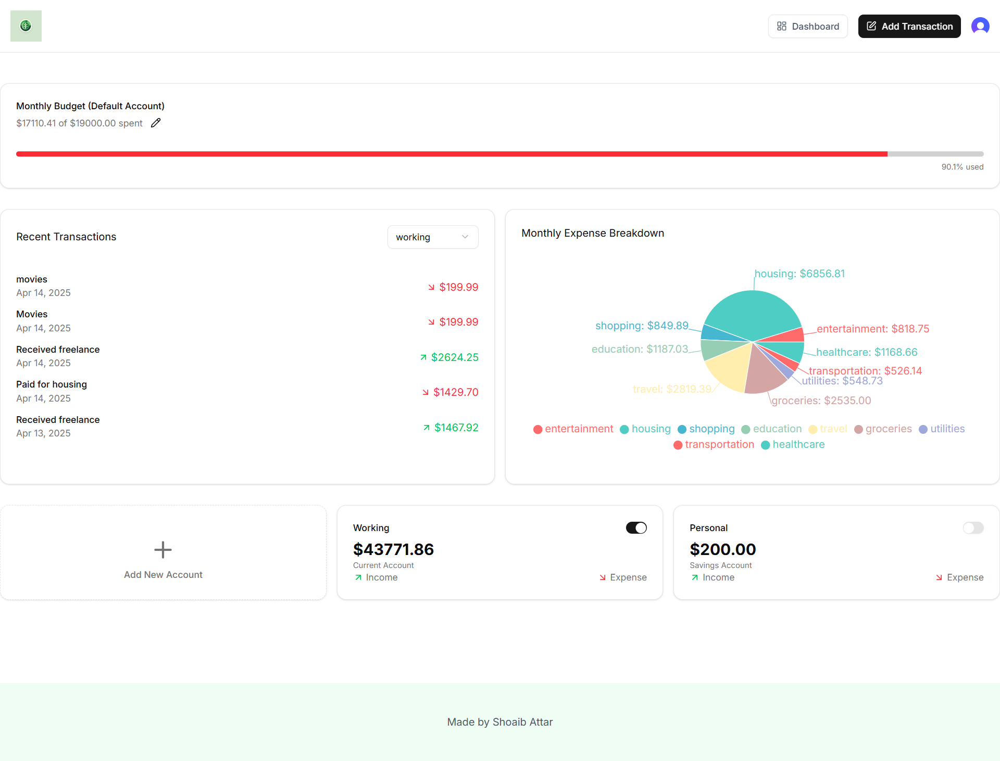
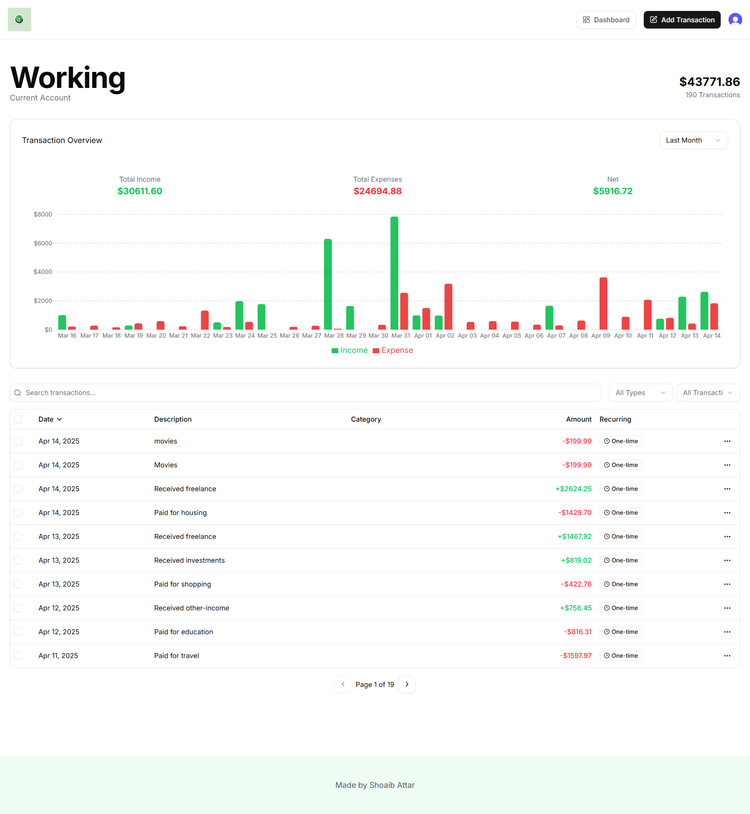

# Moniq - A Personal Financial Manager and Expense Tracker

[](https://nextjs.org) [](https://developer.mozilla.org/en-US/docs/Web/JavaScript) [](https://developer.mozilla.org/en-US/docs/Web/Guide/HTML/HTML5)
 [](https://tailwindcss.com) [](#)[](https://moniq-a-personal-financial-manager-and-expense-tracker-zduo.vercel.app/)

---


An AI-powered financial management platform built to help you gain complete control over your finances. Leveraging modern web technologies and innovative AI solutions, this platform provides an intuitive, powerful, and secure environment to manage budgets, track expenses, and receive intelligent financial insights.

---

## Overview

This platform integrates state-of-the-art tools and frameworks to create a seamless, full stack finance application. By combining advanced AI capabilities with a modern tech stack, it offers a data-driven approach to financial planning and management. Whether you're an individual looking to manage personal expenses or a business aiming to leverage financial analytics, this platform equips you with the tools needed to make informed decisions.

---

<p align="center">

</p>


## Key Features

- **Intelligent Financial Insights:** Harness the power of AI (Gemini AI) to analyze spending patterns, predict trends, and provide actionable recommendations.
- **Real-time Expense Tracking:** Monitor your daily transactions and update budgets in real time.
- **Advanced Analytics & Reporting:** Visualize financial data with interactive dashboards and detailed reports.
- **Secure & Scalable Architecture:** Built on Supabase for robust backend services and secure data handling.
- **Customizable UI:** Experience a sleek, responsive design with Shadcn UI components and Tailwind CSS.

<p align="center">

</p>


---

## Technology Stack

- **Next.js:** Utilized as the primary React framework for creating fast, SEO-friendly, server-side rendered applications.
- **Supabase:** Provides an open-source backend solution offering authentication, real-time databases, and storage.
- **Tailwind CSS:** A utility-first CSS framework that accelerates UI development with pre-built classes for rapid styling.
- **Prisma:** Acts as the ORM layer, simplifying database access and management with type-safe queries.
- **Inngest:** Manages asynchronous tasks and event-driven workflows to ensure scalability and responsiveness.
- **Shadcn UI:** A modular component library that facilitates the creation of beautiful, consistent user interfaces.
- **Gemini AI:** Powers the platform’s AI functionalities, analyzing financial data to deliver smart insights and recommendations.

---

## Installation & Setup

### Prerequisites

Before starting, ensure your environment meets the following requirements:

- **Node.js** (v14 or later)
- **npm**, **yarn**, or **pnpm**
- **Git**

### Step-by-Step Setup

1. **Clone the Repository**

   Clone the project repository to your local machine:

   ```bash
   git clone https://github.com/YourUsername/your-ai-finance-platform.git
   cd your-ai-finance-platform
   ```

2. **Install Dependencies**

   Use your preferred package manager to install all required dependencies:

   ```bash
   npm install
   # or
   yarn install
   # or
   pnpm install
   ```

3. **Configure Environment Variables**

   Create a `.env` file in the root directory and configure the necessary environment variables, including credentials for Supabase, Gemini AI, and any other required APIs.

4. **Run Database Migrations**

   With Prisma as your ORM, execute the migrations to set up your database schema:

   ```bash
   npx prisma migrate dev
   ```

5. **Start the Development Server**

   Launch the development environment to begin working on the project:

   ```bash
   npm run dev
   # or
   yarn dev
   # or
   pnpm dev
   ```

6. **Access the Application**

   Once running, open your browser and navigate to [http://localhost:3000](http://localhost:3000) to explore the platform.

---

<p align="center">

</p>


## Usage

- **Manage Finances:** Log expenses, categorize transactions, and maintain personalized budgets.
- **Generate Reports:** Use the advanced analytics dashboard to review and export detailed financial reports.
- **Leverage AI Insights:** Receive predictive financial insights powered by Gemini AI to make smarter financial decisions.
- **Customizable Workflows:** Benefit from asynchronous event handling through Inngest, ensuring the platform scales with your data.
- **Automated Email Notifications:** Resend ensures that all users receive timely and accurate monthly email notifications of expenditure and AI Insights.

Developers can extend and customize the core functionalities by modifying the source code located within the `/app` directory. Rapid iteration is enabled through Next.js’ hot reloading and modular component architecture.

---
